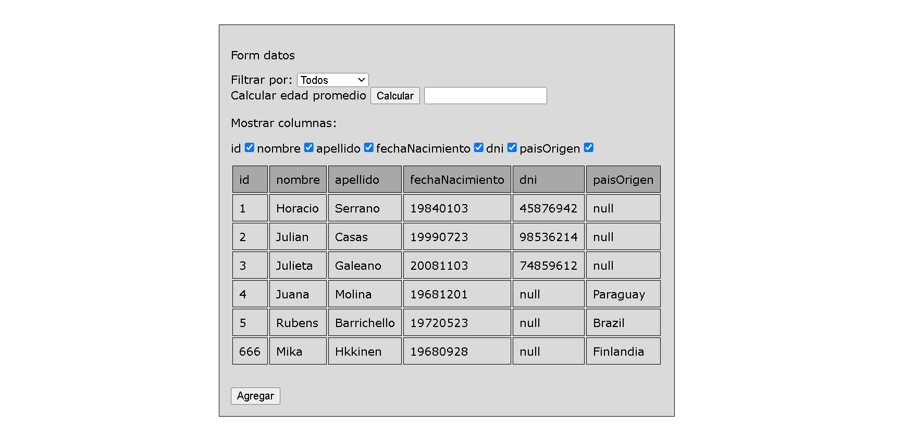
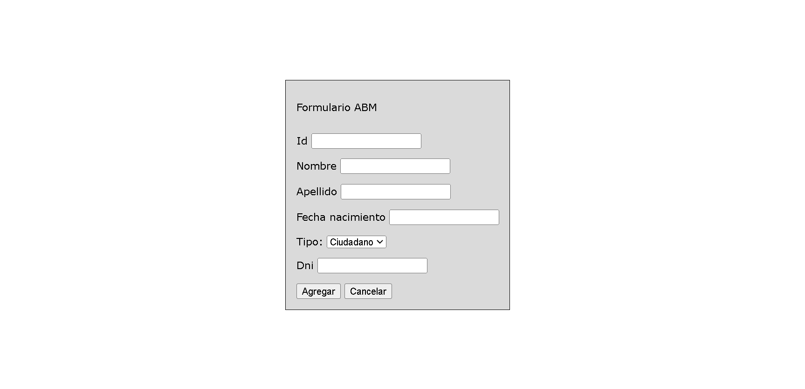
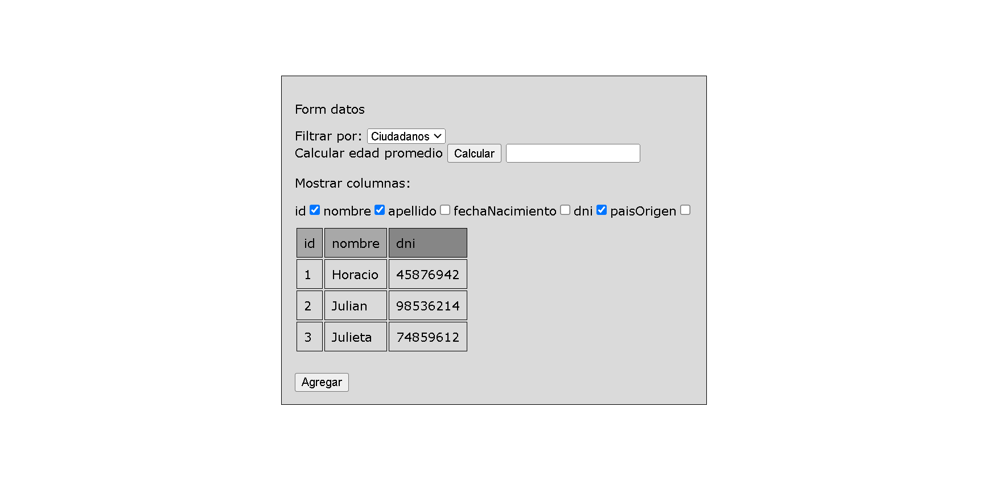

# CRUD (create, read, update, delete) 

### Utilizando HTML, CSS y JAVASCRIPT genero un CRUD a traves del aprovechamiento de la manipulación de objetos html dinámica de AJAX.

## Funcionalidades:
El crud cuenta, además, con las funcionalidades de:
-Filtrar la lista que se muestra según el tipo (Ciudadano/Extranjero)
-Calcular edad de los que se muestran en la tabla
-Segun estén los checkboxes tildados o no la columna asociada a él se muestra o no.
-Funciones de ABM (Alta de nueva persona, baja y modificación) con validaciones pertinentes.
-El diseño es responsivo; a los diferentes tamaños de una pantalla desktop responde sin desfasarse